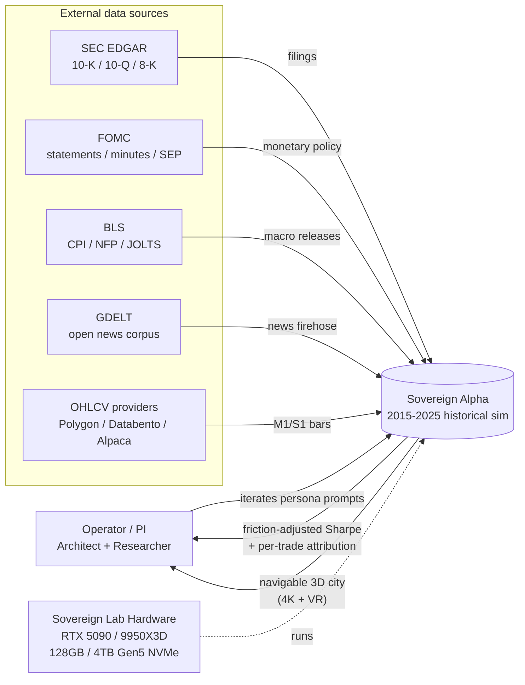
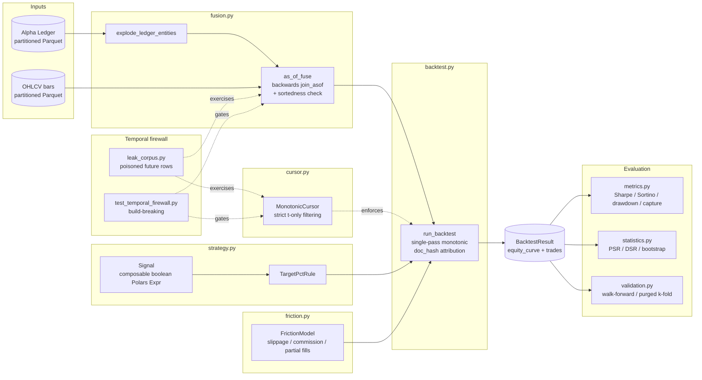

# Architecture — C4 Model

Per master directive §0.5.1.H. Three C4 levels (Context, Containers, Components). The Code level is omitted because the codebase, Pydantic schemas, and ADRs already document at that altitude.

---

## Level 1 — System Context

What is Sovereign Alpha and who/what does it talk to?

**Boundary:** everything inside Sovereign Alpha runs on the single Sovereign Lab box (ADR-0006). External data sources are read-only, batch-ingested into the data lake; nothing leaves the box.

---

## Level 2 — Containers

The three modules + the shared infrastructure that binds them.

```mermaid
flowchart TB
    subgraph MOD1[Module I — Async Semantic Extraction]
        ING[Ingestion adapters<br/>edgar / fomc / bls / gdelt]
        TOK[Tokenization pipeline<br/>clean -> chunk -> cached encode]
        INF[LLM inference<br/>DeepSeek-R1 32B q6_k via vLLM/llama.cpp]
        PER[Persona library<br/>6 versioned analyst archetypes]
    end

    subgraph MOD2[Module II — Quant Engine]
        FUSE[Data fusion<br/>as_of_fuse + MonotonicCursor]
        STRAT[Strategy DSL<br/>Signal + TargetPctRule]
        FRIC[Friction layer<br/>slippage / commission / partial fills]
        BT[Backtest runner<br/>monotonic, attribution-bearing]
        METRICS[Metrics + Statistics<br/>Sharpe / Sortino / PSR / DSR / bootstrap]
        VAL[Out-of-sample CV<br/>walk-forward + purged k-fold]
    end

    subgraph MOD3[Module III — UE5 Digital Twin]
        BUS[ZMQ + MessagePack bus<br/>5 topics]
        UE5[UE5 client<br/>Nanite + Lumen + Niagara]
    end

    subgraph SHARED[shared/]
        SCH[Schemas<br/>Pydantic + Pandera contracts]
        MANI[Run manifests<br/>content-addressed reproducibility]
    end

    subgraph LAKE[Data lake — Hive-partitioned Parquet]
        CORPUS[Raw corpus<br/>~1.8M docs]
        LEDGER[Alpha Ledger<br/>per persona]
        BARS[OHLCV bars<br/>M1 / S1]
        RUNS[Backtest runs<br/>+ manifests]
    end

    ING --> CORPUS
    CORPUS --> TOK --> INF
    PER --> INF
    INF --> LEDGER

    LEDGER --> FUSE
    BARS --> FUSE
    FUSE --> BT
    STRAT --> BT
    FRIC --> BT
    BT --> METRICS
    BT --> VAL
    BT --> RUNS

    BT --> BUS --> UE5

    SCH -. validates .-> LEDGER
    SCH -. validates .-> BARS
    SCH -. validates .-> BUS
    MANI -. tags .-> RUNS
    MANI -. tags .-> LEDGER

    classDef bootstrap fill:#fff4e6,stroke:#d97706
    class INF bootstrap
    class UE5 bootstrap
```

**Bootstrap-phase substitutes (highlighted orange):** until the Sovereign Lab hardware lands, `INF` is replaced by the synthetic Alpha Ledger generator and `UE5` is replaced by a Python-side mock subscriber. Both run inside the same containers; only the implementations swap. See `docs/HARDWARE_ARRIVAL_DAY.md`.

---

## Level 3 — Module II Components

Zoom into the quant engine.

The temporal firewall (ADR-0002) cuts across the diagram: every arrow that crosses a time-axis boundary either passes through `as_of_fuse` or `MonotonicCursor`, and is guarded by the build-breaking leak test.

---

## How to update these diagrams

When a new top-level container or major component lands:
1. Update the relevant Mermaid diagram above.
2. If the change reflects a decision worth recording, add the corresponding ADR under `docs/adr/`.
3. Keep the bootstrap-phase visual marker (orange `bootstrap` class) on any container whose current implementation is a pre-hardware substitute.
